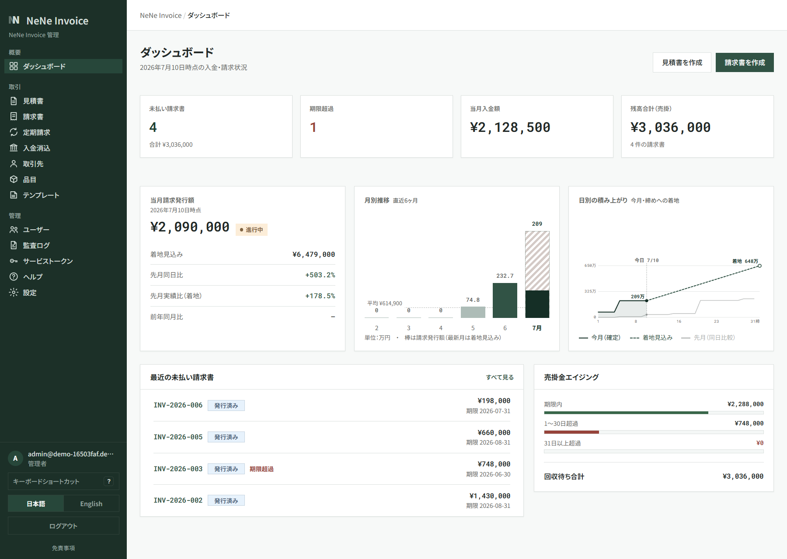
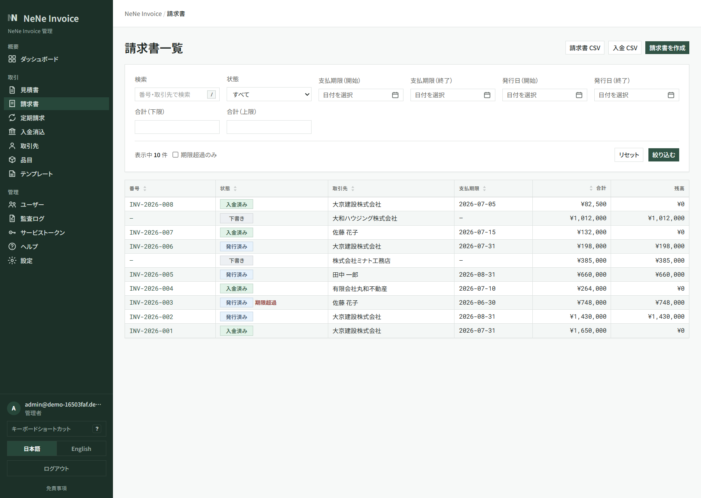
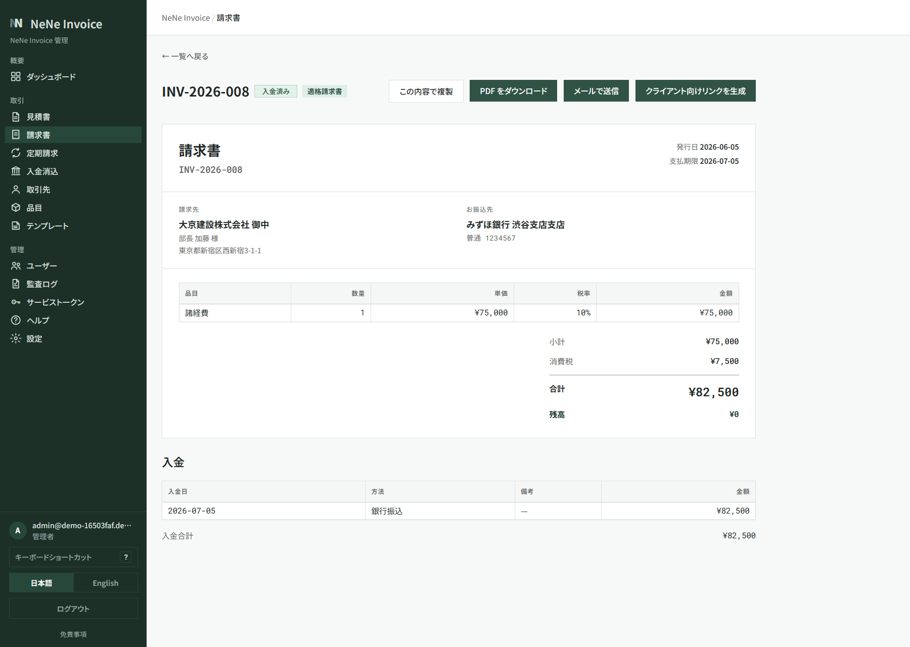
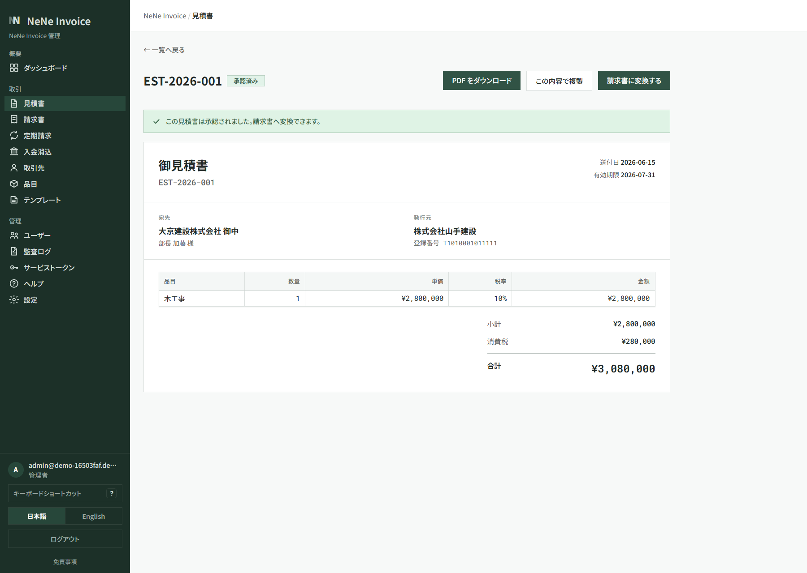
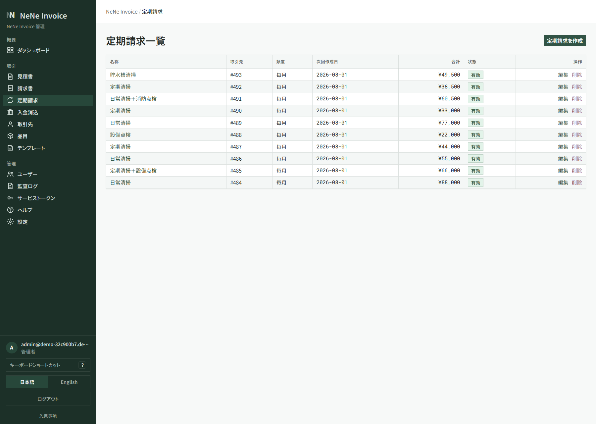

# NeNe Invoice

[](./LICENSE)
[](https://www.php.net/)
[](https://github.com/hideyukiMORI/nene-invoice/actions/workflows/backend-ci.yml)
[](https://github.com/hideyukiMORI/nene-invoice/actions/workflows/frontend-ci.yml)

**Quote, invoice, and payment tracking for Japan SMB — self-hosted on your stack.**

NeNe Invoice is an open-source billing platform built on [NENE2](https://github.com/hideyukiMORI/NENE2). Create quotes, issue **qualified invoice** (適格請求書) PDFs, track payments, and run everything on shared hosting or Docker — without a monthly SaaS fee.

**Primary audience:** Japanese B2B SMBs that quote before invoicing (wholesalers, contractors, agencies) and the tax-advisory offices that support them.
**Example operator:** an office manager on shared hosting issues invoice-compliant PDFs from admin UI instead of Excel + manual PDF — see [`docs/explanation/product-vision.md`](./docs/explanation/product-vision.md#primary-persona).

> **Separate product** — billing logic lives here and only here; it is never embedded in a sibling product. Boundaries are binding:
>
> | Sibling | Boundary |
> | --- | --- |
> | NeNe Records / Corpus / Concierge | Optional HTTP link only — no shared DB, no embedded billing ([ADR 0002](./docs/adr/0002-separate-from-sibling-products.md)) |
> | NeNe Clear | Downstream consumer (reconciliation / dunning) via `/api/*` service tokens — Invoice is the billing SSOT ([ADR 0009](./docs/adr/0009-accept-nene-clear-upstream-contract.md)) |
> | NeNe Suite | Managed-cloud delivery — federation via `organizations.external_id` ([ADR 0016](./docs/adr/0016-conform-to-suite-federation-contract.md)) |

## Live demo

Try it now — no sign-up. Each link provisions a **brand-new disposable organization** seeded with industry data and drops you straight into its dashboard. Demo organizations are deleted automatically after a few hours; hit the link again for a fresh one.

| Industry template | URL |
| --- | --- |
| 建設・工務店 (construction) | <https://invoice.ayane.co.jp/demo/kensetsu> |
| ビルメンテ・清掃 (building maintenance, recurring billing) | <https://invoice.ayane.co.jp/demo/bldmainte> |
| 制作・コンサル (production / consulting, withholding tax) | <https://invoice.ayane.co.jp/demo/seisaku> |

### Screenshots

From a disposable demo organization. Japanese UI shown — the admin UI is bilingual (ja/en, one-click switch).

**Dashboard — unpaid and overdue invoices at a glance, with monthly trends and receivables aging.**



**Invoice list — every invoice tracked by status, from draft to issued, paid, and overdue.**



**Invoice detail — qualified invoice (適格請求書) fields, PDF download, and payment recording in one place.**



**Quote detail — an approved quote converts to an invoice in one click, registration number included.**



**Recurring billing — schedules generate draft invoices automatically every month.**



## Goals

- **Japan invoice compliance** — registration number, tax rates, qualified invoice PDF fields
- **Self-hosted OSS** — MIT licensed; Tier A shared hosting or Tier B Docker/VPS
- **Quote-to-cash** — estimate → invoice → payment in one product
- **Multi-tenant from the foundation** — superadmin manages organizations, admin manages users; single-SMB installs run in `single` mode ([ADR 0006](./docs/adr/0006-multi-tenancy-and-roles.md))
- **Sibling to NeNe ecosystem** — optional HTTP link to Records / Concierge; never merged into CMS
- **AI-readable** — OpenAPI contract, MCP for ops, explicit Clean Architecture
- **Bilingual, not multilingual** — Japanese + English admin UI for operators (incl. non-Japanese running businesses in Japan); other locales are a deliberate non-goal ([ADR 0005](./docs/adr/0005-bilingual-ja-en-scope.md))

## Non-goals

- Not full accounting / general ledger
- Not payroll or expense reimbursement
- Not inventory or POS
- Not a WordPress plugin
- Not embedded inside NeNe Records

Full list: [`docs/explanation/product-vision.md#non-goals`](./docs/explanation/product-vision.md#non-goals)

## Quick Start

### Option A — Docker (recommended, fastest)

No PHP or Node needed on the host. One command brings up the API, the built admin UI, MySQL, and Mailpit; migrations and dev seed data run automatically.

```bash
git clone https://github.com/hideyukiMORI/nene-invoice.git
cd nene-invoice
docker compose up -d --build

# API + admin UI: http://localhost:8510   (sign in: admin@example.com / password123)
# Mailpit inbox:  http://localhost:8585
# phpMyAdmin:     http://localhost:8581
curl http://localhost:8510/health        # {"status":"ok","checks":{"database":"ok"}}
```

The admin SPA is baked into the image. After editing frontend code run `docker compose build app`, or use the host Vite dev server (Option B) for HMR.

### Option B — Host (PHP + Node on your machine)

For active development with live reload (SQLite by default).

```bash
composer install
composer check                          # PHPUnit + PHPStan 8 + php-cs-fixer
php tools/seed-dev.php                   # dev users + sample data (admin@example.com / password123)

# Backend API (front controller as router)
php -S localhost:8510 -t public_html public_html/index.php
curl http://localhost:8510/health       # {"status":"ok","checks":{"database":"ok"}}

# Admin SPA (separate terminal) — Vite dev server on :5185
cd frontend && npm install && npm run dev
```

> SQLite dev needs an absolute `DB_NAME` path in `.env` (the built-in server's cwd is the docroot). For mail, run host Mailpit: `docker compose up -d mailpit`.

### Option C — Shared hosting (Tier A production)

Download a release ZIP, upload it, and run the web installer (`public_html/install.php`) — no CLI or root required. Full walkthrough: [`docs/operator-guide-ja.md`](./docs/operator-guide-ja.md).

## Local ports

NeNe Invoice owns the **`85**` port lane**; sibling products use their own lanes so several apps can run locally side by side (full policy: [`CLAUDE.md`](./CLAUDE.md)). Override via `NENE_INVOICE_*` in `.env`.

| Service | Port |
| --- | --- |
| API + admin UI (Docker app or PHP dev server) | 8510 |
| Vite dev server (frontend HMR) | 5185 |
| MySQL (Docker) | 3585 |
| phpMyAdmin (Docker) | 8581 |
| Mailpit — SMTP / Web UI | 1585 / 8585 |

## Architecture

```
Admin UI (React SPA)  ──→  NeNe Invoice API (NENE2 / PHP 8.4)  ──→  MySQL / SQLite
Ops / MCP             ──→            │  ▲
NeNe Clear ──HTTP /api/*─────────────┘  │   (reconciliation / dunning — Invoice = billing SSOT)
                                     ↓ HTTP (optional)
                          NeNe Records / NeNe Concierge
```

Managed-cloud delivery is orchestrated by **NeNe Suite** (federation IdP + installer); Invoice's
path into it is the `organizations.external_id` federation link and the federation epic.

- **Backend**: PHP 8.4, NENE2, Handler → UseCase → Repository (org-scoped, ADR 0006)
- **Money**: integer cents everywhere — no floats; tax rounded once per rate (ADR 0004)
- **PDF**: server-side qualified-invoice generation (mPDF, Japanese fonts)
- **Audit**: every mutating operation recorded with before/after snapshots (ADR 0008)
- **Deploy**: Tier A (shared-hosting installer + release ZIP) shipped; Tier B (Docker) per ADR 0003

## Status

| Phase | Scope | Status |
| --- | --- | --- |
| 0 | Governance + product docs | ✅ |
| 1 | Core billing API — auth, multi-tenancy, clients, quotes, invoices, payments | ✅ |
| 2 | Admin UI (React) + qualified-invoice PDF + dashboard + audit log + ja/en | ✅ |
| 3 | Tier A shared hosting — installer, release ZIP, operator guide | ✅ |
| Sec | Security assessment rounds 1–2 (findings fixed) | ✅ |
| 4 | Ecosystem integration — financial cluster, payment gateway, managed cloud | 🔄 In progress |

Key shipped features (Phase 4 highlights):

- **Recurring billing** (`/recurring`) — schedules generate draft invoices automatically, via cron (Tier B) or inline on admin requests (Tier A)
- **Bank-transfer auto-reconciliation** (`/bank-reconciliation`) — CSV import → payer-alias matching → confirm-to-record
- **Type-B multi-tenancy** — superadmin org provisioning + per-client SPA served under `/{slug}/`
- **Hosted card payments** (PAY.JP, SAQ-A) and silent re-authentication via httpOnly refresh cookie
- **Live NeNe Clear link** (contract-verified) and the public **disposable-org demo** (`/demo/{template}`)
- CSV export, service-token management, list search / filter / sort, ja/en language switcher

In progress / designed: MFA (TOTP), fee write-off & over-payment split (tax-advisor gated), bulk issuing, industry template refinements. Details and sequencing: [`docs/roadmap.md`](./docs/roadmap.md) and [`docs/todo/current.md`](./docs/todo/current.md).

> **Sync rule:** any PR that updates `docs/todo/current.md` also updates this Status section (repo practice since #572).

## Documentation

| Topic | Document |
| --- | --- |
| **Compliance (binding)** | [`docs/explanation/accounting-compliance.md`](./docs/explanation/accounting-compliance.md) |
| **Product vision** | [`docs/explanation/product-vision.md`](./docs/explanation/product-vision.md) |
| **Requirements** | [`docs/explanation/requirements.md`](./docs/explanation/requirements.md) |
| **Domain model** | [`docs/explanation/domain-model.md`](./docs/explanation/domain-model.md) |
| **Glossary** | [`docs/explanation/glossary.md`](./docs/explanation/glossary.md) |
| **Terminology registry** | [`docs/explanation/terminology.md`](./docs/explanation/terminology.md) |
| **Operator guide (Tier A, ja)** | [`docs/operator-guide-ja.md`](./docs/operator-guide-ja.md) |
| **Start here (agents)** | [`AGENTS.md`](./AGENTS.md) |
| **Workflow** | [`docs/workflow.md`](./docs/workflow.md) |

## Ecosystem

Part of the [hideyukiMORI NeNe portfolio](https://github.com/hideyukiMORI):

| Product | Role |
| --- | --- |
| [NENE2](https://github.com/hideyukiMORI/NENE2) | Framework runtime |
| [nene-records](https://github.com/hideyukiMORI/nene-records) | CMS · optional product catalog |
| [nene-corpus](https://github.com/hideyukiMORI/nene-corpus) | Knowledge chat |
| [nene-concierge](https://github.com/hideyukiMORI/nene-concierge) | Scenario chat · optional leads |
| [nene-clear](https://github.com/hideyukiMORI/nene-clear) | Reconciliation · dunning — downstream consumer of this billing SSOT |
| [nene-suite](https://github.com/hideyukiMORI/nene-suite) | Multi-app installer · federation IdP · managed cloud |
| **nene-invoice** | Quote · invoice · payment — financial-cluster foundation (this repo) |

## Contributing

Issue-driven development — see [`docs/CONTRIBUTING.md`](./docs/CONTRIBUTING.md).

## License

MIT — see [LICENSE](./LICENSE).
