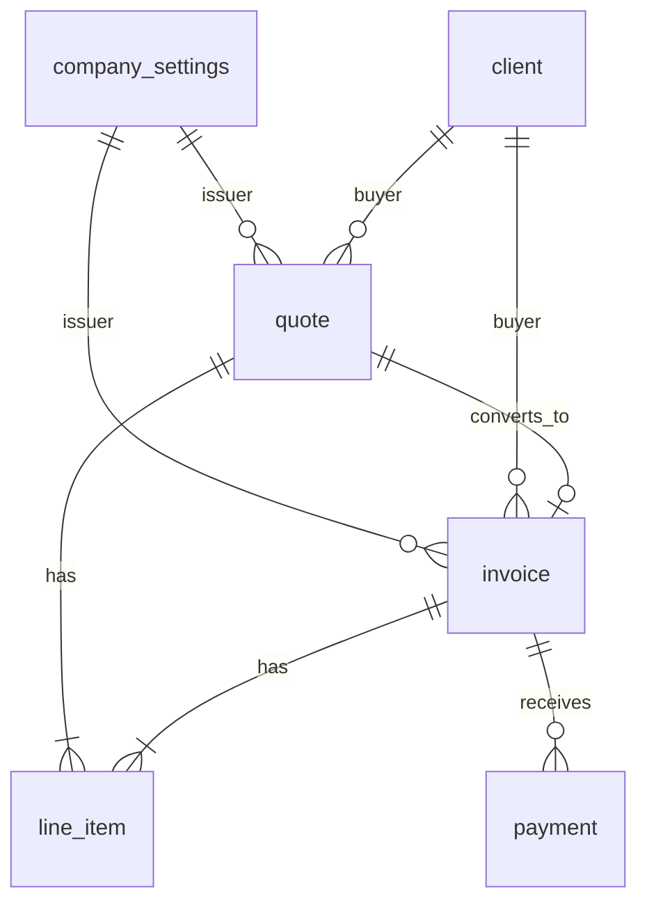

# Domain Model

NeNe Invoice domain overview — entities, relationships, and state machines. Implementation follows Handler → UseCase → Repository layering.

See also: [`requirements.md`](./requirements.md), [`glossary.md`](./glossary.md).

---

## Entity relationship (MVP)



- **company_settings**: singleton per organization (Phase 1 single-tenant; multi-tenant adds `organization_id`).
- **line_item**: polymorphic parent — `parent_type` + `parent_id` (`quote` or `invoice`).
- **payment**: always linked to one invoice; partial payments sum to `amount_cents` on invoice.

---

## Quote state machine

```
                    ┌──────────┐
                    │  draft   │
                    └────┬─────┘
                         │ finalize / send
                         ▼
                    ┌──────────┐
         ┌──────────│   sent   │──────────┐
         │          └────┬─────┘          │
         │ reject        │ accept         │ valid_until passed
         ▼               ▼                ▼
    ┌──────────┐   ┌──────────┐     ┌──────────┐
    │ rejected │   │ accepted │     │ expired  │
    └──────────┘   └────┬─────┘     └──────────┘
                        │ convert_to_invoice
                        ▼
                   (creates invoice)
```

**Rules:**

- Only `draft` quotes are freely editable.
- `sent` quotes: line items locked; status transitions only.
- Only `accepted` quotes may convert to invoice (UseCase validates).

---

## Invoice state machine

```
                    ┌──────────┐
                    │  draft   │
                    └────┬─────┘
                         │ issue (generates number, locks fields)
                         ▼
                    ┌──────────┐
         ┌──────────│  issued  │────────────────┐
         │          └────┬─────┘                │
         │               │ record payment       │ due_at < today
         │               ▼                      ▼
         │     ┌──────────────────┐        ┌──────────┐
         │     │ partially_paid   │        │ overdue  │ (computed flag)
         │     └────────┬─────────┘        └──────────┘
         │              │ full payment
         │              ▼
         │         ┌──────────┐
         └────────►│   paid   │
                   └──────────┘
```

**Rules:**

- `issued` invoices: line items and tax totals immutable (credit notes = Phase 4+).
- `paid` when sum(payments.amount_cents) >= invoice.total_cents.
- `overdue`: computed when status is `issued` or `partially_paid` and `due_at < now`.

---

## Tax calculation (UseCase)

Single source of truth for API and PDF. Consumption tax is rounded **once per
tax rate per document** — never per line item — to comply with the qualified
invoice system. See [ADR 0004](../adr/0004-tax-rounding-per-rate.md).

```
For each line_item:
  line_subtotal_cents = quantity * unit_price_cents   # not rounded for tax

Group by tax_rate_bps:
  taxable_amount_cents[rate] += line_subtotal_cents
  tax_cents[rate] = round(taxable_amount_cents[rate] * rate / 10000)   # round ONCE per rate

subtotal_cents = sum(taxable_amount_cents[rate])
tax_cents = sum(tax_cents[rate])
total_cents = subtotal_cents + tax_cents
```

Rounding: half-up to integer minimum currency units, applied per rate group, not
per line. Any per-line tax shown in the UI is illustrative only and must not be
summed into the document total. Rationale and rejected alternatives:
[ADR 0004](../adr/0004-tax-rounding-per-rate.md).

---

## Document numbering

| Document | Pattern | Example |
| --- | --- | --- |
| Quote | `{prefix}{year}-{seq:03d}` | `EST-2026-001` |
| Invoice | `{prefix}{year}-{seq:03d}` | `INV-2026-001` |

Sequences scoped per organization and year. Stored in `document_sequences` table (Phase 1).

---

## PDF generation boundary

```
UseCase (calculates totals, validates qualified fields)
    ↓ InvoicePdfInput DTO
Pdf/InvoicePdfGenerator (infrastructure — TCPDF or similar)
    ↓ bytes
Handler (Content-Type: application/pdf)
```

UseCase never calls PDF library directly. Handler never recalculates tax.

---

## Planned modules (`src/`)

| Module | Responsibility |
| --- | --- |
| `Company/` | Issuer profile settings |
| `Client/` | Buyer master |
| `Quote/` | Quote CRUD, status transitions |
| `Invoice/` | Invoice CRUD, issue, convert from quote |
| `LineItem/` | Shared line item attach/detach |
| `Payment/` | Payment recording |
| `Pdf/` | PDF rendering adapters |
| `DocumentSequence/` | Auto-number generation |
| `AdminAuth/` | JWT login |
| `Upstream/` | Optional Records / Concierge HTTP clients |

---

## Integration touchpoints (Phase 4+)

| Event | Direction | Action |
| --- | --- | --- |
| Concierge lead captured | Concierge → Invoice | POST webhook creates `client` draft + optional `quote` draft |
| Records product selected | Invoice → Records | GET catalog item → prefill line_item description and unit_price_cents |
| Invoice issued | Invoice → external | Webhook or email (SMTP) — no sibling required |

---

## Related

- Requirements: [`requirements.md`](./requirements.md)
- Backend standards: [`../development/backend-standards.md`](../development/backend-standards.md)
- ADR 0002: [`../adr/0002-separate-from-sibling-products.md`](../adr/0002-separate-from-sibling-products.md)
- ADR 0004 (tax rounding): [`../adr/0004-tax-rounding-per-rate.md`](../adr/0004-tax-rounding-per-rate.md)
